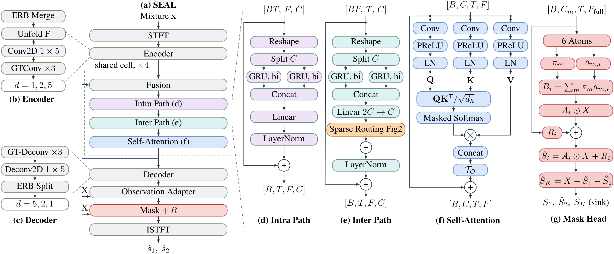
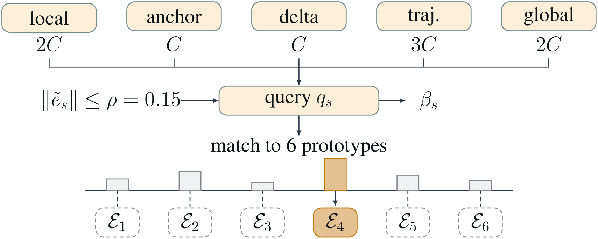

<h3 align="center">SEAL: Mixture-Closed Reconstruction and Refinement-Aware Routing for Speech Separation</h3>
<p align="center">
  <strong>Shao-Chun Hu, Zi-Xiang Lin, Jeih-Weih Hung, Hung-Shin Lee</strong><br>
  <a href="https://arxiv.org/abs/xxxx.xxxxx">📜 Paper (Coming Soon)</a> | <a href="https://Xiang-Lin75.github.io/SEAL/">🎶 Demo</a>
</p>

<p align="center">
  
  
</p>

> SEAL is a highly efficient model for single-channel speech separation that combines a shared-weight DPGRNN cell, refinement-aware Top-1 routing over stateless residual experts, and conservation-structured latent reconstruction to preserve mixture closure.

## 💥 News

- **[2026-09]** We release the codebase and pre-trained model of SEAL-small! 🚀
- **[2026-09]** Our interactive separation [Audio Demo](https://Xiang-Lin75.github.io/SEAL/) is now live!

## 📜 Abstract

Single-channel speech separation demands highly efficient architectures capable of parsing complex acoustic environments. We propose SEAL (Sparse Expert routing with Additive Latent reconstruction), a novel non-causal speech separation model. SEAL integrates three core design principles: (1) a shared-weight DPGRNN cell that iteratively updates a feature state; (2) refinement-aware Top-1 routing over stateless residual experts, guided by a norm-capped step cue; and (3) conservation-structured six-atom latent reconstruction with a bounded additive complex correction and a residual sink that guarantees mixture closure. Experimental results demonstrate that SEAL-small achieves 12.89 dB SI-SDRi on the EchoSet test set with only 590K parameters and 2.64G MACs/s, providing a compact, scalable, and mathematically bounded approach to state-of-the-art speech separation.

## SEAL Architecture

Overall pipeline of the model architecture of SEAL and its modules.



Detailed view of the Temporal Readout mechanism.



## 📊 Results

Performance of the SEAL-small operating point on EchoSet. Exact values and the
metric conventions are listed in the [model card](MODEL_CARD.md).

| Dataset | SI-SDRi (dB) | BSS-SDRi (dB) | Params (M) | MACs (G/s) |
|---|---:|---:|---:|---:|
| EchoSet test | 12.89 | 13.62 | 0.59 | 2.64 |

## 📦 Installation

Use Python 3.10+ with a suitable [PyTorch build](https://pytorch.org/get-started/locally/) for your CPU or CUDA device.

```bash
git clone https://github.com/Xiang-Lin75/SEAL.git
cd SEAL
python -m venv .venv
source .venv/bin/activate          # Windows PowerShell: .venv\Scripts\Activate.ps1
python -m pip install --upgrade pip
python -m pip install -e .
```

## 🚀 Quick Start

### Test with Pre-trained Model

Download `seal-small-e266.tar` from the latest GitHub release into `checkpoints/`.

```bash
python inference.py \
  --config checkpoints/e266_config_historical.yaml \
  --checkpoint checkpoints/seal-small-e266.tar \
  --legacy-e266 \
  --audio mixture.wav \
  --output-dir outputs/example
```

### Train with EchoSet

Download and extract [EchoSet](https://huggingface.co/datasets/JusperLee/EchoSet).

```bash
export ECHOSET_ROOT=/path/to/EchoSet
python train.py -C configs/seal_small_echoset.yaml -D 0
```

`-D` takes GPU ids (`-D 0,1` trains with DDP on two GPUs) or `cpu` for a slow
single-process run. Runs are written to `exp/seal_small_echoset_<run id>/`; to
continue an interrupted run, set `trainer.resume: true` and
`trainer.resume_datetime: <run id>` in the config and rerun the same command.

### Evaluate with EchoSet

```bash
python evaluate.py \
  --config checkpoints/e266_config_historical.yaml \
  --checkpoint checkpoints/seal-small-e266.tar \
  --legacy-e266 \
  --data-dir /path/to/EchoSet/test \
  --output-csv outputs/e266_test.csv
```

To evaluate a model you trained yourself, point `--config` at the training
config and `--checkpoint` at `exp/<run>/checkpoints/best_model.tar`, and add
`--trust-checkpoint`: trainer checkpoints also store NumPy RNG state, which the
restricted loader refuses. Only use this flag for files you produced.

## 🗂️ Code Structure

```text
seal/
  models/
    seal.py        SEAL model (SEALBaseline -> SEALCore -> SEAL)
    separator.py   shared-weight DPGRNN cell unrolled over refinement steps
    routing.py     Top-1 temporal readout experts and refinement-aware router
    heads.py       mixture-closed latent-atom mask and additive correction
    blocks.py      ERB/SFE front-end, conv/recurrent blocks, encoder, decoder
  data/            EchoSet loader
  losses/          PIT and TIGER-compatible losses
  metrics/         SI-SDR, BSS-SDR, PESQ/STOI
configs/           SEAL-small and SEAL-large training configs
entrypoints/       trainer (run through train.py)
scripts/           complexity measurement and the E266 checkpoint loader
```

```python
from seal.models import SEAL

model = SEAL(n_fft=512, hop_len=256, win_len=512)   # see configs/ for all options
separated = model(mixture)                          # (B, L) -> (B, 2, L)
```

## 📖 Citation

If you use SEAL, please cite the accompanying paper and this software:

```bibtex
@software{Hu_SEAL,
  author = {Hu, Shao-Chun and Lin, Zi-Xiang and Hung, Jeih-Weih and Lee, Hung-Shin},
  title = {{SEAL: Mixture-Closed Reconstruction and Refinement-Aware Routing for Speech Separation}},
  url = {https://github.com/Xiang-Lin75/SEAL},
  version = {0.2.0}
}
```

## 📧 Contact

If you have any questions, please feel free to open an issue or contact the authors.
